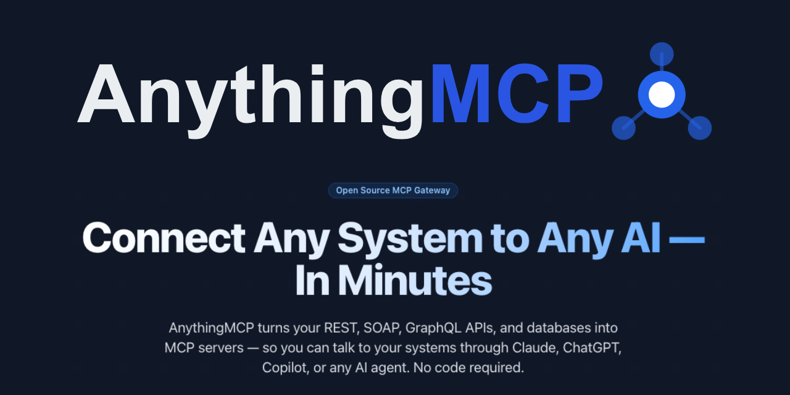

<p align="center">
  <h1 align="center">AnythingMCP</h1>
  <p align="center">
    <strong>Convert any API into an MCP server in minutes.</strong><br/>
    REST API to MCP &bull; SOAP to MCP &bull; GraphQL to MCP &bull; Database to MCP &bull; MCP Gateway & Middleware
  </p>
  <p align="center">
    <a href="https://github.com/HelpCode-ai/anythingmcp/stargazers"></a>&nbsp;
    <a href="https://github.com/HelpCode-ai/anythingmcp/blob/main/LICENSE"></a>&nbsp;
    <a href="https://github.com/HelpCode-ai/anythingmcp/releases"></a>&nbsp;
    <a href="https://hub.docker.com/r/helpcodeai/anythingmcp"></a>&nbsp;
    &nbsp;
    &nbsp;
    &nbsp;
    <a href="https://github.com/HelpCode-ai/anythingmcp/pulls"></a>&nbsp;
    <a href="https://github.com/HelpCode-ai/anythingmcp/graphs/contributors"></a>&nbsp;
    <a href="https://github.com/HelpCode-ai/anythingmcp/commits/main"></a>&nbsp;
    <a href="https://github.com/HelpCode-ai/anythingmcp/releases"></a>
  </p>
</p>

<p align="center">
  <strong>⭐ Star this repo if you find it useful — it helps others discover AnythingMCP!</strong>
</p>

<p align="center">
  
</p>

---

## Deploy in One Click

[](https://railway.com/deploy/8-X4WD?referralCode=k30bPV&utm_medium=integration&utm_source=template&utm_campaign=generic)
&nbsp;&nbsp;
[](https://marketplace.digitalocean.com/apps/anythingmcp)

### Railway

1. Click the Railway button above to open the Railway template.
2. Fill in the required environment variables (secrets are auto-generated for you).
3. Click **Deploy** — Railway will build the container and provision a managed PostgreSQL database.
4. Once the deploy is complete (2-3 minutes), open the generated URL and register your admin account. By default, only the admin can self-register — invite other users from the admin panel. Set `ALLOW_OPEN_REGISTRATION=true` to allow anyone to register.

### DigitalOcean Marketplace

1. Click the DigitalOcean button above to open the [AnythingMCP listing on the DigitalOcean Marketplace](https://marketplace.digitalocean.com/apps/anythingmcp).
2. Click **Create AnythingMCP Droplet** and choose your preferred droplet size and region.
3. Once the droplet is ready, open the droplet IP in your browser and register your admin account.

> **Self-hosting instead?** Run `./setup.sh` for the interactive Docker setup. See [Quick Start](#quick-start) below.

---

**AnythingMCP** is a self-hosted, source-available MCP middleware that turns your existing APIs into [MCP (Model Context Protocol)](https://modelcontextprotocol.io/) servers. Connect **any** API — REST, SOAP, GraphQL, databases, or other MCP servers — and expose them as tools to AI clients like **Claude**, **ChatGPT**, **Gemini**, **Copilot**, **Cursor**, and more.

No SDK. No code changes. Just point, configure, and connect.

> **Looking for an MCP gateway?** AnythingMCP acts as a universal MCP proxy and API-to-MCP bridge — the missing middleware between your APIs and AI agents.

<p align="center">
  
  <br/>
  <a href="https://anythingmcp.com/en/video-promo"><strong>Watch the demo video</strong></a>
</p>

---

> 🏭 **Built for production** — AnythingMCP was born from real-world needs at a German industrial group connecting 15+ legacy systems (ERP, CRM, IoT) to AI agents.

---

## Get Started in 60 Seconds

```bash
git clone https://github.com/HelpCode-ai/anythingmcp.git
cd anythingmcp && ./setup.sh
# Open http://localhost:3000 — done!
```

See the full [Quick Start](#quick-start) below for detailed configuration options.

---

## Use Cases

- **Talk to your ERP from Claude Desktop** — connect SAP, Oracle, or any REST/SOAP ERP and query it conversationally
- **Let AI agents query your production database safely** — read-only database connectors with audit logging
- **Bridge legacy SOAP services to modern AI workflows** — automatic WSDL parsing, no code changes
- **Aggregate multiple MCP servers behind one gateway** — MCP-to-MCP bridge for unified tool access
- **Import your Postman collection and get MCP tools instantly** — zero-config API onboarding

---

## Why AnythingMCP?

| Problem | Solution |
|---------|----------|
| You have REST APIs but AI clients speak MCP | **REST API to MCP** conversion with OpenAPI/Swagger import |
| You have legacy SOAP/WSDL services | **SOAP to MCP** bridge with automatic WSDL parsing |
| You need to query databases from AI agents | **Database to MCP** with auto-generated query tools |
| You want one MCP gateway for all your APIs | **MCP middleware** that aggregates multiple connectors |
| You need auth, audit logs, and role-based access | Built-in **enterprise governance** layer |

---

## How AnythingMCP Compares

| Feature | AnythingMCP | Custom MCP Server | Other Gateways |
|---------|:-----------:|:-----------------:|:--------------:|
| No-code setup | ✅ Visual editor | ❌ Write code | ⚠️ Config files |
| SOAP / WSDL support | ✅ Built-in | ❌ Manual | ❌ Rare |
| Database connectors | ✅ 7 engines | ❌ Build yourself | ⚠️ Limited |
| Visual tool editor | ✅ | ❌ | ❌ |
| Auth & audit trail | ✅ OAuth2, RBAC, logs | ❌ DIY | ⚠️ Partial |
| Self-hosted | ✅ Docker / Railway / DigitalOcean | ✅ | ⚠️ Often SaaS-only |
| Multi-client support | ✅ Claude, ChatGPT, Gemini, Copilot, Cursor | ✅ | ⚠️ Varies |

---

## Key Features

- **5 Connector Types** — [REST](docs/connectors/rest.md), [SOAP](docs/connectors/soap.md), [GraphQL](docs/connectors/graphql.md), [Database](docs/connectors/database.md) (PostgreSQL, MySQL, MariaDB, MSSQL, Oracle, MongoDB, SQLite), [MCP-to-MCP Bridge](docs/connectors/mcp-bridge.md)
- **6 Import Formats** — OpenAPI/Swagger, Postman Collections, cURL commands, WSDL, GraphQL introspection, custom JSON
- **Dynamic MCP Server** — Tools registered at runtime, no restart needed
- **Visual Tool Editor** — Map parameters to path, query, body, headers visually
- **Database Auto-Tools** — Schema introspection + dynamic query execution out of the box
- **Environment Variables** — Per-connector `{{VAR}}` interpolation, hidden from AI
- **Full Auth** — OAuth2 (PKCE + Client Credentials), Bearer Token, API Key, Basic Auth, WS-Security, Certificates
- **Audit Logging** — Every tool invocation logged with input, output, duration, status
- **Roles & Access Control** — Tool-level whitelisting per custom role
- **Per-User MCP API Keys** — Individual keys with usage tracking
- **Docker Ready** — `docker compose up` and you're running

---

## Quick Start

```bash
git clone https://github.com/HelpCode-ai/anythingmcp.git
cd anythingmcp
./setup.sh                 # Interactive setup — generates .env, starts Docker
```

The setup script configures everything interactively: deployment mode, domain/SSL, auth, email, Redis, and more. All secrets are auto-generated. First user to register becomes Admin.

**What `setup.sh` handles:**
- Domain and HTTPS — for production domains, enables **Caddy** reverse proxy with automatic Let's Encrypt SSL
- Secrets — generates JWT, encryption keys, and database passwords
- MCP authentication mode — OAuth 2.0, API Key, or both
- Optional SMTP and Redis configuration

> **Prefer manual setup?** Copy `.env.example` to `.env`, edit the values, and run `docker compose up -d`. See the [Deployment Guide](docs/deployment.md) for details.

| Service | Default URL |
|---------|-------------|
| Web UI | `http://localhost:3000` (or `https://yourdomain.com` with Caddy) |
| Backend API | `http://localhost:4000` |
| MCP Endpoint | `http://localhost:4000/mcp` |
| Swagger Docs | `http://localhost:4000/api/docs` |

> **Next step:** Create a connector, import your API spec, and connect your AI client. See the [Connector Guides](#connector-guides) below.

---

## Connect Your AI Client

AnythingMCP works with any MCP-compatible client. Follow the guide for your AI tool:

| Client | Guide | Transport |
|--------|-------|-----------|
| **Claude Desktop** | [Setup Guide](docs/integrations/claude.md) | Streamable HTTP |
| **Claude Code** | [Setup Guide](docs/integrations/claude.md#claude-code) | Streamable HTTP |
| **ChatGPT** | [Setup Guide](docs/integrations/chatgpt.md) | Streamable HTTP |
| **Google Gemini** | [Setup Guide](docs/integrations/gemini.md) | HTTP / SSE |
| **GitHub Copilot** | [Setup Guide](docs/integrations/copilot.md) | Streamable HTTP |
| **Cursor** | [Setup Guide](docs/integrations/claude.md#cursor) | Streamable HTTP |
| **Any MCP Client** | [Setup Guide](docs/integrations/claude.md#any-mcp-client) | Streamable HTTP |

---

## Connector Guides

Each connector type has dedicated documentation with setup instructions, examples, and best practices:

| Connector | Use Case | Docs |
|-----------|----------|------|
| **REST** | HTTP APIs, OpenAPI/Swagger, Postman | [REST Connector Guide](docs/connectors/rest.md) |
| **SOAP** | WSDL web services, WCF, legacy enterprise APIs | [SOAP Connector Guide](docs/connectors/soap.md) |
| **GraphQL** | GraphQL endpoints with introspection | [GraphQL Connector Guide](docs/connectors/graphql.md) |
| **Database** | PostgreSQL, MySQL, MariaDB, MSSQL, Oracle, MongoDB, SQLite | [Database Connector Guide](docs/connectors/database.md) |
| **MCP Bridge** | Aggregate multiple MCP servers into one | [MCP Bridge Guide](docs/connectors/mcp-bridge.md) |

---

## Architecture

```
                        ┌─────────────────────────────────┐
  Claude Desktop ──────►│                                 │
  ChatGPT ─────────────►│         AnythingMCP             │──── REST APIs
  Gemini CLI ──────────►│      (MCP Middleware)            │──── SOAP Services
  GitHub Copilot ──────►│                                 │──── GraphQL Endpoints
  Cursor ──────────────►│   MCP Protocol (HTTP)           │──── PostgreSQL / MySQL / MSSQL / MongoDB / ...
  Any MCP Client ──────►│                                 │──── Other MCP Servers
                        └─────────────────────────────────┘
                          Caddy (optional) │ automatic HTTPS
                          Next.js UI + NestJS Backend
                          PostgreSQL  │  Redis (optional)
```

**How it works:**

1. **Create a Connector** — Point to your API (REST base URL, WSDL endpoint, GraphQL URL, database connection string)
2. **Import or Define Tools** — Auto-import from OpenAPI/Postman/WSDL/GraphQL or define manually
3. **Connect AI Clients** — Point your MCP client to `http://your-server:4000/mcp`
4. **AI calls tools** — AnythingMCP translates MCP tool calls into actual API requests and returns results

---

## Documentation

| Topic | Description |
|-------|-------------|
| [API Reference](docs/api-reference.md) | Full REST API for connectors, tools, auth, audit |
| [Tool Definition Format](docs/tool-definition.md) | Parameters, endpoint mapping, response mapping |
| [Deployment Guide](docs/deployment.md) | Docker, production setup, reverse proxy, env vars |
| [Authentication](docs/deployment.md#authentication) | OAuth2, JWT, API keys, MCP auth modes |

---

## Tech Stack

| Layer | Technology |
|-------|------------|
| Frontend | Next.js 16, React 19, Tailwind CSS v4 |
| Backend | NestJS 11, TypeScript |
| MCP | @modelcontextprotocol/sdk, Streamable HTTP |
| Database | PostgreSQL 17, Prisma 7 |
| Cache | Redis 7 (optional) |
| Reverse Proxy | Caddy 2 (optional — automatic HTTPS via Let's Encrypt) |
| Auth | JWT, OAuth2, AES-256-GCM |
| Deploy | Docker (single container for app) + Docker Compose |

---

## Development

The easiest way to set up local development:

```bash
./setup.sh    # Choose "Local development" mode
npm run dev
```

Or see the [Deployment Guide](docs/deployment.md#local-development) for manual setup.

---

## Community & Support

- **Questions & Discussions** — [GitHub Discussions](https://github.com/HelpCode-ai/anythingmcp/discussions)
- **Bug Reports** — [Open an issue](https://github.com/HelpCode-ai/anythingmcp/issues)
- **Feature Requests** — [Request a feature](https://github.com/HelpCode-ai/anythingmcp/issues/new?labels=enhancement&template=feature_request.md)
- **Built by** [helpcode.ai](https://helpcode.ai) — AI-powered software development from Germany

---

## Contributing

We welcome contributions! Please read our [Contributing Guide](CONTRIBUTING.md) before submitting a PR.

For security issues, see [SECURITY.md](SECURITY.md).

---

## License

AnythingMCP is **source-available** under the [Business Source License 1.1](LICENSE) (BSL-1.1). This is _not_ an OSI-approved open-source license — see the [License FAQ](docs/license-faq.md) for a plain-language explanation.

- **Free for**: internal use, personal use, development, testing, evaluation, academic use
- **Not permitted**: offering as a commercial hosted service (SaaS) without a separate license
- **Change Date**: 2030-03-04 — on this date the license automatically converts to [Apache 2.0](https://www.apache.org/licenses/LICENSE-2.0)

For commercial licensing: [info@helpcode.ai](mailto:info@helpcode.ai)

> **Transparency note:** AnythingMCP makes optional network calls to `anythingmcp.com` for license verification and email delivery when SMTP is not configured. No API credentials or tool invocation data is ever sent. See [External Services](docs/deployment.md#external-services) for full details.

Copyright (c) 2026 helpcode.ai GmbH
