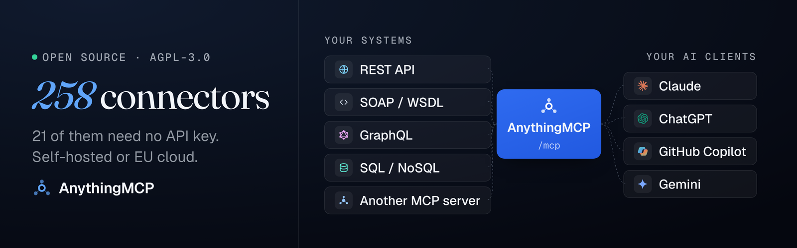
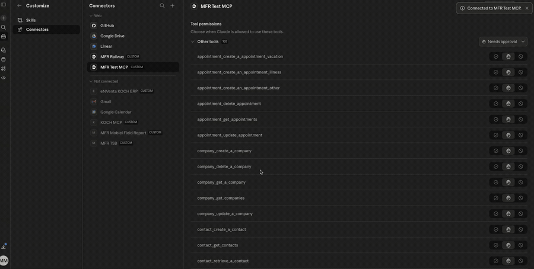

<p align="center">
  
</p>

<h1 align="center">AnythingMCP</h1>

<p align="center">
  <a href="README.md">English</a> · <a href="README.de.md">Deutsch</a> · <a href="README.zh-CN.md">简体中文</a> · <a href="README.ja.md">日本語</a>
</p>

<p align="center">
  <strong>将任意 REST/OpenAPI、SOAP、GraphQL 或 SQL API 转化为 Claude、ChatGPT 和 Copilot 可用的 MCP 工具。</strong><br/>
  自行托管的 MCP 服务器与网关，无需编写代码，258 个现成适配器开箱即用，涵盖 ERP 和电子商务：SAP Business One、Odoo、Xentral、weclapp、Shopware、WooCommerce、Amazon Seller、Kaufland 等。
</p>

<p align="center">
  <a href="https://github.com/HelpCode-ai/anythingmcp/stargazers"></a>
  <a href="https://github.com/HelpCode-ai/anythingmcp/releases"></a>
  <a href="https://github.com/HelpCode-ai/anythingmcp/blob/main/LICENSE"></a>
  <a href="https://hub.docker.com/r/helpcodeai/anythingmcp"></a>
</p>

**Claude 回答了一个此前聊天机器人无法回答的问题**，因为相关数据位于使用 REST 而非 MCP 的现场服务系统中：

<p align="center">
  
</p>

**自己运行试试** — 三行命令，无需克隆仓库，[详细说明见下文](#run-it-yourself)：

```bash
mkdir anythingmcp && cd anythingmcp
curl -fsSLo docker-compose.yml \
  https://raw.githubusercontent.com/HelpCode-ai/anythingmcp/main/docker-compose.quickstart.yml
printf 'JWT_SECRET=%s\nENCRYPTION_KEY=%s\n' "$(openssl rand -hex 32)" "$(openssl rand -hex 32)" > .env
docker compose up -d   # → http://localhost:3000
```

---

本文反复使用的三个术语，分别指不同的概念：

- **适配器（adapter）**：本仓库随附的 258 个 JSON 定义之一，例如 SAP Business One、Odoo、weclapp、Xentral、Shopware、WooCommerce、Amazon Seller、DHL 等。其中 21 个完全不需要 API 密钥，其余适配器会在导入时要求你提供相应凭据。
- **连接器（connector）**：在工作区中配置好的适配器，或你自己的 OpenAPI 规范、Postman 集合、WSDL、GraphQL 端点或数据库。只要有可连接的目标，就能在几分钟内完成配置，无需编写 MCP 服务器。
- **MCP 服务器**：你提供给 Claude 的那个 URL。它只公开分配给它的连接器，不会公开其他连接器。

所有组件都运行在你自己的基础设施上，因此你可以决定哪些数据能够离开它。每个工具的响应映射定义哪些字段可以到达模型；凭据以 AES-256-GCM 加密存储；完整的上游响应则保存在你自己的审计日志中。OAuth2、RBAC、SSO 和 SCIM 已包含在自行托管版本中，并非付费套餐专属功能。

**[KOCH Freiburg GmbH](https://www.kochfreiburg.de/) 已在生产环境使用 AnythingMCP**，将 AI 助手连接到 15 个以上的内部系统，包括 ERP、CRM、SOAP 服务和本地数据库。德国弗赖堡的 [helpcode.ai](https://helpcode.ai) 将 AnythingMCP 从该系统中提取出来并开源，因为适配器目录由社区共同建设，比作为单一产品发展得更快。

---

<a id="run-it-yourself"></a>

## 自己运行

**推荐使用以下方式**，下方的性能测量也基于此方式。需要 Docker 24+ 和 `openssl`；在 macOS 上，请先启动 Docker Desktop。

```bash
mkdir anythingmcp && cd anythingmcp
curl -fsSLo docker-compose.yml \
  https://raw.githubusercontent.com/HelpCode-ai/anythingmcp/main/docker-compose.quickstart.yml
printf 'JWT_SECRET=%s\nENCRYPTION_KEY=%s\n' "$(openssl rand -hex 32)" "$(openssl rand -hex 32)" > .env
docker compose up -d
```

打开 <http://localhost:3000> 并注册 — **第一个账户将成为管理员**。

> **请妥善保存生成的 `.env` 文件。** `ENCRYPTION_KEY` 用于解密已存储的凭据。如果丢失它，就必须重新为每个连接器配置凭据。请将其备份到你保存其他机密信息的位置。

| 服务 | 默认 URL |
|---|---|
| Web 界面 | `http://localhost:3000` |
| MCP 端点 | `http://localhost:4000/mcp` |
| Swagger 文档 | `http://localhost:4000/api/docs` |

*amd64 实测：拉取镜像耗时 31 秒，API 就绪并显示登录页面耗时 24 秒。目前发布的镜像仅支持 amd64。Compose 文件明确指定了平台，因此也可以通过 Docker Desktop 的模拟功能在 Apple Silicon 上运行。在一台 M 系列芯片笔记本上，同样的启动过程耗时 24 秒，但在较旧的硬件上可能需要几分钟。*

快速启动配置有意将服务绑定到 `127.0.0.1`，因为前面还没有负责 TLS 终止的组件。**如果需要让其他人或云端 AI 客户端访问实例**，请克隆仓库并运行 `./setup.sh`。该脚本会询问域名、通过 Caddy 获取证书、生成机密信息，并设置 MCP 认证模式。详见[部署指南](docs/deployment.md)。

<details>
<summary><strong>其他部署方式</strong> — 托管云、Railway、DigitalOcean</summary>

<br/>

[**AnythingMCP Cloud**](https://cloud.anythingmcp.com) 使用相同的 AGPL 代码，由我们在**德国法兰克福**运营。你可以先在那里连接自己的 API，体验功能，而无需自行准备基础设施；如果之后希望将凭据保留在内部，也可以迁移到自行托管环境，两种方式使用相同的连接器。可通过 [info@helpcode.ai](mailto:info@helpcode.ai) 申请 DPA/AVV。SSO 和 SCIM 仅适用于自行托管版本。

[](https://railway.com/deploy/8-X4WD?referralCode=k30bPV&utm_medium=integration&utm_source=template&utm_campaign=generic)
&nbsp;
[](https://marketplace.digitalocean.com/apps/anythingmcp)

</details>

---

<a id="connect-any-system"></a>

## 连接任意系统

大多数企业还没有 MCP 服务器，它们有的是 REST API、ERP、SOAP 服务和数据库。每个系统都可以变成一组 MCP 工具，再通过一个 MCP 服务器 URL 提供给 Claude、ChatGPT 或 Copilot。

<a id="openapi--rest-api-to-mcp"></a>

### OpenAPI / REST API 转 MCP

通过 URL 或直接粘贴导入 OpenAPI 3.x 或 Swagger 2.0 规范，每个操作都会成为一个 MCP 工具，参数、认证和端点映射均已自动填好。你可以在可视化编辑器中为工具重命名并添加描述，帮助模型选对工具。[REST 连接器文档](docs/connectors/rest.md) · [指南](https://anythingmcp.com/zh/guides/rest-api-to-mcp)

<a id="soap--wsdl-to-mcp"></a>

### SOAP / WSDL 转 MCP

将 AnythingMCP 指向一个 WSDL，每个 SOAP 操作都会成为一个工具：SOAP 信封、参数顺序、WS-Security 和 WCF 服务都会自动处理。这样，2009 年的 SOAP 服务只需几分钟而不是几周，就能交给 2026 年的模型使用。[SOAP 连接器文档](docs/connectors/soap.md) · [指南](https://anythingmcp.com/zh/guides/soap-to-mcp)

<a id="sql-database-to-mcp"></a>

### SQL 数据库转 MCP

支持 PostgreSQL、MySQL、MariaDB、SQL Server、Oracle、SQLite 和 MongoDB。连接器会生成查看 schema、示例和查询的工具；由你决定模型是自己编写 SQL，还是只为你预先写好的查询填写参数。请为它配置一个只读数据库用户，并分配一个只能看到所需工具的角色。[数据库连接器文档](docs/connectors/database.md) · [指南](https://anythingmcp.com/zh/guides/database-to-mcp)

<a id="graphql-to-mcp"></a>

### GraphQL 转 MCP

通过内省，GraphQL 端点的查询（query）和变更（mutation）会转化为 MCP 工具；你也可以自行定义操作。[GraphQL 连接器文档](docs/connectors/graphql.md) · [指南](https://anythingmcp.com/zh/guides/graphql-to-mcp)

<a id="postman-collection-to-mcp"></a>

### Postman 集合转 MCP

导入 Postman v2.1 集合：文件夹、认证、请求体模式和 `{{variables}}` 都会保留，每个请求都会成为一个工具。cURL 命令同样适用。[Postman 导入文档](docs/connectors/rest.md#from-postman-collection)

---

<a id="erp-connectors"></a>

## ERP 连接器

为大多数订单、库存和发票问题背后的 ERP 提供现成适配器。安装适配器并填入凭据后，工具即可在你的 MCP 服务器上使用。点击系统名称即可查看对应的设置指南。

| 系统 | 市场 | 工具数 | AI 可以做什么 |
|---|---|---|---|
| [SAP Business One](https://anythingmcp.com/zh/guides/connect-sap-business-one-to-claude) | 全球 | 12 | 业务伙伴、物料、订单、发票、报价单、交货单；创建销售订单 |
| [SAP S/4HANA Cloud](https://anythingmcp.com/zh/guides/connect-sap-s4hana-cloud-to-claude) | 全球 | 15 | 业务伙伴、销售订单和采购订单、开票凭证、交货单、会计分录 |
| [Odoo](https://anythingmcp.com/zh/guides/connect-odoo-to-claude) | 全球 | 11 | 任意模型：合作伙伴、销售订单、发票、产品；可创建和更新 |
| [Microsoft Dynamics NAV](https://anythingmcp.com/zh/guides/connect-dynamics-nav-to-claude) | 全球 | 6 | 任意已发布的 OData 页面：客户、物料、销售订单；可创建和更新 |
| [ERPNext](https://anythingmcp.com/zh/guides/connect-erpnext-to-claude) | 全球 | 11 | 任意 DocType：客户、销售订单、发票、物料、库存 |
| [Dolibarr](https://anythingmcp.com/zh/guides/connect-dolibarr-to-claude) | 全球 | 10 | 第三方、发票、订单、商业提案、产品、库存 |
| [JTL-Wawi](https://anythingmcp.com/zh/guides/connect-jtl-wawi-to-claude) † | DE | 9 | 商品、各仓库库存、客户、销售订单、发货 |
| [Xentral](https://anythingmcp.com/zh/guides/connect-xentral-to-claude) | DE | 7 | 商品、客户、销售订单、发票、库存 |
| [weclapp](https://anythingmcp.com/zh/guides/connect-weclapp-to-claude) | DACH | 11 | 客户、销售订单、发票、商品、报价单、销售机会 |
| [Sage 100](https://anythingmcp.com/zh/guides/connect-sage-100-to-claude) † | DE | 6 | 地址、物料、销售单据、任意 Web API 实体 |
| [Haufe X360](https://anythingmcp.com/zh/guides/connect-haufe-x360-to-claude) † | DE | 7 | 客户、库存物料、销售订单、发票、发货 |
| [ScopeVisio](https://anythingmcp.com/zh/guides/connect-scopevisio-to-claude) | DE | 6 | 联系人、发票、项目、任务 |
| [AFAS Profit](https://anythingmcp.com/zh/guides/connect-afas-profit-to-claude) † | NL | 6 | 任意 GetConnector：应收客户、发票、员工 |
| [Zucchetti](https://anythingmcp.com/zh/guides/connect-zucchetti-to-claude) † | IT | 6 | 主数据（Anagrafiche）、单据、物料 |
| [TeamSystem](https://anythingmcp.com/zh/guides/connect-teamsystem-to-claude) † | IT | 6 | 客户、供应商、发票、物料 |
| [Axonaut](https://anythingmcp.com/zh/guides/connect-axonaut-to-claude) † | FR | 9 | 公司、发票、报价单、费用、产品、项目 |

† 根据供应商公开的 API 文档构建，尚未在实际运行的租户上测试。如果你正在使用其中某个系统，非常欢迎提交问题反馈或修复。

**你的 ERP 不在列表中，或者是定制开发、本地部署的系统？** 可以通过它的 [REST API](#openapi--rest-api-to-mcp)、[SOAP 服务](#soap--wsdl-to-mcp) 连接，也可以以只读方式直接连接它的 [SQL 数据库](#sql-database-to-mcp)。[KOCH Freiburg](https://www.kochfreiburg.de/) 在生产环境中就是这样接入其 ERP 的。

---

<a id="e-commerce--marketplace-connectors"></a>

## 电子商务与电商平台连接器

覆盖网店和电商平台，从 Amazon、eBay 到 DACH 地区的电商平台。点击系统名称即可查看对应的设置指南。

| 系统 | 市场 | 工具数 | AI 可以做什么 |
|---|---|---|---|
| [Amazon Seller Central](https://anythingmcp.com/zh/guides/connect-amazon-seller-to-claude) | 全球 | 15 | 订单、商品目录、FBA 库存、报价、费用、财务事件、报表 |
| [WooCommerce](https://anythingmcp.com/zh/guides/connect-woocommerce-to-claude) | 全球 | 49 | 商品、变体、库存、订单、退款、客户、报表 |
| [Shopware 6](https://anythingmcp.com/zh/guides/connect-shopware-6-to-claude) | DACH | 6 | 通过 Store API 读取店面商品目录：商品、分类、交叉销售 |
| [Magento 2 / Adobe Commerce](https://anythingmcp.com/zh/guides/connect-magento-to-claude) | 全球 | 12 | 商品、库存、订单、客户 |
| [BigCommerce](https://anythingmcp.com/zh/guides/connect-bigcommerce-to-claude) | 全球 | 14 | 商品、变体、库存、订单、客户 |
| [eBay Sell](https://anythingmcp.com/zh/guides/connect-ebay-sell-to-claude) | 全球 | 10 | 库存、报价、订单、纠纷、价格更新 |
| [Etsy](https://anythingmcp.com/zh/guides/connect-etsy-to-claude) | 全球 | 9 | 商品刊登、收据（订单）、评价 |
| [Ecwid](https://anythingmcp.com/zh/guides/connect-ecwid-to-claude) | 全球 | 10 | 商品、分类、订单、客户 |
| [Kaufland Marketplace](https://anythingmcp.com/zh/guides/connect-kaufland-to-claude) | DE | 8 | 订单及订单单元、发货、工单、店铺 |
| [OTTO Market](https://anythingmcp.com/zh/guides/connect-otto-market-to-claude) † | DE | 8 | 订单、商品、退货、库存和价格更新 |
| [Zalando Direct Ship](https://anythingmcp.com/zh/guides/connect-zalando-zds-to-claude) † | EU | 7 | 订单、发货、退货、库存、价格 |
| [Billbee](https://anythingmcp.com/guides/connect-billbee-to-claude) | DACH | 8 | 订单、商品、客户、物流服务商 |
| [Mercado Libre](https://anythingmcp.com/zh/guides/connect-mercado-libre-to-claude) | LATAM | 4 | 商品搜索、卖家订单 |

† 根据供应商公开的 API 文档构建，尚未在实际运行的卖家账户上测试。

---

## 连接、管理与学习

### 连接

- **5 种连接器类型** — [REST](docs/connectors/rest.md)、[SOAP](docs/connectors/soap.md)、[GraphQL](docs/connectors/graphql.md)、[数据库](docs/connectors/database.md)、[MCP 到 MCP 桥接](docs/connectors/mcp-bridge.md)。支持七种数据库引擎：PostgreSQL、MySQL、MariaDB、MSSQL、Oracle、MongoDB、SQLite。
- **导入现有资源** — OpenAPI/Swagger、Postman、cURL、WSDL、GraphQL 内省，或直接从运行中的 MCP 服务器发现工具。
- **适配器目录** — [查看已随附的内容](#the-adapter-catalog)。
- **可视化工具编辑器** — 将参数映射到路径、查询参数、请求体和请求头；调整工具的名称和描述，让 AI 按照你的意图理解它们。
- **动态 MCP 服务器** — 工具在运行时注册，无需重启。支持每个连接器独立的 `{{VAR}}` 插值，且对 AI 隐藏。

### 管理

- **[响应塑形](#control-what-the-model-sees)** — 精确定义每个工具可以向模型提供哪些字段，并实时预览处理前后的结果。
- **在需要的地方只允许读取。** 每个工具都带有 MCP 注解（`readOnlyHint`、`destructiveHint`），根据操作类型生成，也可以按工具覆盖。因此，客户端能够区分读取发票和开具贷项通知单。基于角色的工具白名单可以让你发布一个只读 MCP 服务器，这也是大多数人在接入 ERP 时应采用的起点。
- **覆盖常见认证方式** — OAuth2（PKCE 和 Client Credentials）、Bearer、API Key、Basic、WS-Security、客户端证书、[LOGIN_TOKEN](docs/connectors/login-token-auth.md) 和 OAuth 1.0a。
- **审计日志** — 每次工具调用的输入、输出、耗时和状态都会记录在你自己的数据库中。
- **[SSO](docs/sso.md) 和 [SCIM](docs/scim-entra-setup.md)** — 支持 Entra ID、Google、Okta、Auth0 及通用 OIDC。每次登录都会从目录服务的用户组同步角色。在目录中停用用户，其工作区访问权限和 MCP API 密钥也会随之失效（仅适用于自行托管版本）。

### 学习

- **[知识图谱](docs/knowledge-graph.md)** — 为每个工作区维护一张保护个人身份信息（PII）的关系图，展示连接器数据之间的联系，并以 MCP 工具的形式提供给智能体，帮助它正确串联跨系统调用。
- **[AI 技能](docs/knowledge-graph.md)** — 将重复出现的使用模式转化为简短、可复用的规则，并合并到服务器指令中，使其无需增加工具调用就能引导智能体（可选，需主动启用）。

---

## AnythingMCP 与其他项目的区别

AnythingMCP 是一个从更早一步开始的 MCP 网关：它根据你已经在运行的 API、ERP 和数据库创建 MCP 服务器，再通过同一个端点提供服务、限定访问范围并进行审计。其他 MCP 网关负责聚合和保护你已经拥有的 MCP 服务器，但大多数企业至今还没有 MCP 服务器，只有 REST API、一个 2009 年的 SOAP 服务，以及不希望直接暴露的数据库。下面的每个项目都在解决实际问题，只是它们解决的并不是同一个问题。

| | 项目定位 | 以下情况更适合选择它 |
|---|---|---|
| **[ContextForge](https://github.com/IBM/mcp-context-forge)**（IBM） | 为现有 MCP 服务器提供联邦聚合和注册中心 | 你的工具已经是 MCP 服务器，需要的是联邦聚合、虚拟服务器和注册中心 |
| **[Docker MCP Gateway](https://github.com/docker/mcp-gateway)** | 将目录中的 MCP 服务器作为容器运行在同一个端点后，并处理机密信息 | 你希望将供应商发布的 MCP 服务器隔离在 Docker 中，且现有目录已能满足需求 |
| **[MetaMCP](https://github.com/metatool-ai/metamcp)** | 通过中间件层，将 MCP 服务器聚合到划分了命名空间的端点中 | 你主要需要按客户端对现有 MCP 服务器分组，并重新限定其访问范围 |
| **[Composio](https://github.com/ComposioHQ/composio)** | 提供托管集成目录，并代为处理认证 | 固定的托管目录已足够，且你不需要加入自己的 SOAP 服务、内部 API 或数据库 |
| **AnythingMCP** | 将企业已经运行的 API、SOAP 服务和数据库转化为 MCP 工具 | 你的系统**还不是** MCP 服务器，而且你希望能够选择自行保管凭据 |

包含完整功能表的逐项比较页面：[anythingmcp.com/vs](https://anythingmcp.com/vs)。

---

<a id="knowledge-graph--ai-skills"></a>

## 知识图谱与 AI 技能

单纯转发调用，仍会把最困难的部分留给智能体：下一步该调用哪个工具，以及业务中的“未完成订单”或“活跃客户”究竟意味着什么。AnythingMCP 会学习这两方面的内容 — **连接器数据之间的关系**，以及**团队实际使用工具的方式** — 再将其作为上下文提供给 AI 客户端，而不是增加额外的工具调用。

- **知识图谱** — 每个工作区都有自己的*实体*（客户、订单、产品等）及其*关系*图。它根据工具名称、参数以及真实调用的输入和输出自动构建；可选的 AI 分析能够推断出启发式规则遗漏的跨连接器关系。它保持 **PII 安全**：只存储实体和字段的*名称*以及关系元数据，绝不存储具体值。
- **可视化构建** — 图编辑器允许你手动创建、编辑和删除实体及关系，添加描述，并审核 AI 提出的建议。
- **通过 MCP 提供** — 每个服务器都公开一个 `kg_how_to_obtain` 工具，让*客户的*智能体可以询问“如何从 Shopware 订单找到 DHL 运单号？”，并获得连接器调用链的提示。
- **从实际使用中生成 AI 技能** — 启用意图记录后，每次工具调用都能记录*为什么*进行这次调用。AI 分析会将重复模式转化为简短、可复用的规则，例如*“今天的营收包括状态为 2、3 和 4 的订单”*。你可以逐条应用、编辑或忽略规则，也可以让系统自动应用置信度高的建议。已应用的技能会在提供服务时合并到 MCP 服务器的**指令**中，**无需增加任何工具调用**就能引导智能体。团队通过使用系统积累的知识，不再只保存在个人的脑海中。

AI 分析**默认关闭**。需要同时启用全局环境变量开关*和*工作区开关，可使用 OpenAI、OpenRouter 或 Anthropic。知识图谱、手动编辑和 MCP 工具本身完全不需要 LLM 密钥。

➡️ **[知识图谱与 AI 技能指南 →](docs/knowledge-graph.md)**

---

<a id="control-what-the-model-sees"></a>

## 控制模型能够看到的内容

每个工具都可以**精确定义哪些字段能够离开你的基础设施**。映射按工具配置，并在响应发出前应用。因此，AI 客户端及其背后的第三方模型只能收到你批准的数据结构。

- **删除不应外传的字段。** 列出需要删除的路径，在响应到达智能体之前将其移除，例如客户的 IBAN、员工薪资，或 API 随数据一并返回的访问令牌。
- **也可以定义整个输出。** `select` 模板指定保留哪些字段以及它们的输出名称；模板无法表达的数据重组可以使用 JMESPath 表达式。如果保留稳定的结构更适合智能体，可以用占位符替换值（`"iban": "= [redacted]"`），而不是直接删除字段。
- **保存之前先查看效果。** 编辑器会对真实响应执行映射，将处理前后结果和大小差异并排显示。某个随附适配器对包含四趟列车的结果进行处理时，测得 **12,172 B → 1,072 B（减少 91%）**。
- **默认采用失败放行行为，并明确说明这一点。** 如果映射在运行时出错，系统会返回原始响应并记录警告，以免一个错误表达式让原本正常工作的工具不可用。但对于绝不能外传的字段，这个默认行为并不合适：请在相应工具上设置 **`"fallbackToRaw": false`**，使映射出错时调用失败，而不是放行原始数据。

这样既能避免敏感字段到达模型，也能减少上下文窗口中需要付费处理的内容。

```json
{
  "transform": {
    "mode": "select",
    "fallbackToRaw": false,
    "exclude": ["customer.iban", "customer.taxId"],
    "select": { "order": "$.id", "total": "$.amounts.gross", "status": "$.state" }
  }
}
```

> 审计日志仍会将完整的上游响应保存在你自己的数据库中。调整智能体可以看到的内容，不会导致你失去 API 实际返回内容的证据。

➡️ **[响应映射参考 →](docs/tool-definition.md#3-response-mapping-optional)**

---

## 无需代码，创建自定义 Claude 连接器

Claude 支持**自定义连接器**：在 *Customize → Connectors* 中添加一次远程 MCP 服务器，即可在 Claude.ai、Claude Desktop 和 Claude Code 中使用。AnythingMCP 可以**从你已有的任意 API 创建这样的连接器**，无需编写 MCP 服务器：

1. 导入 API 规范，或选择一个预置适配器。
2. 在**可视化编辑器**中调整工具名称、描述和参数，由你决定 AI 能够看到的内容。
3. 将 MCP 服务器的 URL 添加为 Claude 的自定义连接器（开箱即支持 OAuth 2.0）。

凭据保留在你的基础设施上，每次工具调用都会记录到审计日志中，基于角色的访问控制则决定哪些用户可以看到哪些工具。[分步指南 →](docs/integrations/claude.md)

---

## 将 API 变成 ChatGPT 应用

**ChatGPT 中的应用基于 MCP 构建**，AnythingMCP 可以直接提供所需的 MCP 后端。将其指向 REST、SOAP、GraphQL 或数据库端点，即可获得适用于 ChatGPT 的连接器。你可以在 ChatGPT 设置中添加它，或将其作为 Apps SDK 应用的工具层，让 ChatGPT 读取业务数据并执行相应操作。

同一个连接器可以同时用于 **Claude、ChatGPT、Gemini、Copilot 和 Cursor**，一次构建，即可在多处连接。[ChatGPT 设置指南 →](docs/integrations/chatgpt.md)

---

## 为什么选择 AnythingMCP？

AI 客户端使用 MCP，而你的系统使用 REST、SOAP、GraphQL 和 SQL。为每个系统单独编写和维护 MCP 服务器，同时处理认证、审计和访问控制，每套都可能花费数周。AnythingMCP 就是两者之间的无代码连接层：

| 问题 | 解决方案 |
|---|---|
| 已有 REST API，但 AI 客户端使用 MCP | 通过 OpenAPI / Swagger 导入实现 **REST → MCP** 转换 |
| 存在旧的 SOAP / WSDL 服务 | 通过自动 WSDL 解析实现 **SOAP → MCP** 桥接 |
| 需要通过 AI 智能体查询数据库 | 自动生成查询工具，实现 **DB → MCP**（7 种引擎） |
| 希望用一个端点访问所有 API | 聚合多个连接器的 **MCP 中间件** |
| 需要 SAP Business One / Odoo / Shopware 等系统的 MCP 服务器 | 使用**适配器目录**，一分钟内完成安装并配置凭据 |
| 无法将凭据交给第三方 | **运行在你自己的基础设施上**，凭据以 AES-256-GCM 加密存储 |
| 需要认证、审计日志和 RBAC | 内置 **OAuth2、审计日志和基于角色的访问控制**，无需自行实现 |
| 第三方模型会看到 API 响应中的所有字段 | 使用**[每个工具独立的响应映射](#control-what-the-model-sees)**，在字段离开网络前将其删除或重组 |
| 智能体以错误顺序调用工具，或无法理解两个系统之间的关系 | **[知识图谱与 AI 技能](#knowledge-graph--ai-skills)** 提供调用链提示和学到的业务规则，作为上下文交给智能体 |

**人们实际用它做什么**

| | 指南 |
|---|---|
| 通过 Claude 与 ERP 交互 | [SAP Business One](https://anythingmcp.com/zh/guides/connect-sap-business-one-to-claude) · [Odoo](https://anythingmcp.com/zh/guides/connect-odoo-to-claude) · [weclapp](https://anythingmcp.com/zh/guides/weclapp-to-mcp) · [Xentral](https://anythingmcp.com/zh/guides/xentral-to-mcp) |
| 查看各网店和电商平台的订单、库存与费用 | [Amazon Seller](https://anythingmcp.com/zh/guides/connect-amazon-seller-to-claude) · [WooCommerce](https://anythingmcp.com/zh/guides/connect-woocommerce-to-claude) · [Kaufland](https://anythingmcp.com/zh/guides/connect-kaufland-to-claude) |
| 追踪包裹 | [DHL](https://anythingmcp.com/guides/dhl-tracking-to-mcp) · [GLS](https://anythingmcp.com/guides/gls-tracking-to-mcp) |
| 付款前核验发票 | [VIES VAT](https://anythingmcp.com/guides/vies-vat-to-mcp) · [Handelsregister](https://anythingmcp.com/guides/handelsregister-to-mcp) |
| 让智能体以只读方式访问生产数据库 | [数据库连接器](docs/connectors/database.md) |
| 将 2009 年的 SOAP 服务连接到 2026 年的模型 | [SOAP → MCP](https://anythingmcp.com/guides/soap-to-mcp) |
| 查询列车、实时晚点信息和路线 | [Deutsche Bahn](https://anythingmcp.com/guides/deutsche-bahn-to-mcp) |

---

<a id="the-adapter-catalog"></a>

## 适配器目录

258 个适配器，提供 2,400 多个工具。**其中 21 个不需要 API 密钥**，其余适配器会在导入时要求提供凭据，导入后工具即可立即使用。每个适配器都在 [anythingmcp.com/guides](https://anythingmcp.com/guides) 上提供七种语言的设置指南。

| 分类 | 示例 |
|---|---|
| 📦 物流与配送 | Deutsche Bahn、DHL、DPD、GLS、Shipcloud、Sendcloud |
| 💼 ERP、会计与开票 | [SAP Business One、Odoo、weclapp、Xentral 以及另外 12 款 ERP](#erp-connectors)、Lexware Office、sevDesk、Exact Online、bexio |
| 🛍️ 电子商务 | [Amazon Seller、WooCommerce、Shopware 6、Kaufland、OTTO 以及另外 8 个平台](#e-commerce--marketplace-connectors)、Oxomi |
| 👥 人力资源与现场服务 | Personio、HRWorks、Kenjo、MFR Mobile Field Report |
| 🏛️ 政务与公开数据 | VIES VAT、Handelsregister、UK Companies House 🇬🇧、DESTATIS、Bundesbank、OpenPLZ、NINA |
| 🏦 银行与支付 | Revolut Business、Wise 🇬🇧、PAYONE、Razorpay 🇮🇳、Paystack 🇳🇬 |
| 💬 消息与通信 | WhatsApp、LINE 🇯🇵、TeamViewer |
| 🎾 体育与 Web3 | Playtomic、Sorare |
| 🏗️ 建筑与地图 | PlanRadar、HERE Geocoding |

**一个适配器就是一个 JSON 文件。** 这既解释了目录为何能够达到现在的规模，也意味着添加适配器很适合作为首次贡献。如果缺少你需要的适配器，可以[提出请求](https://github.com/HelpCode-ai/anythingmcp/issues/new?template=adapter_request.yml)，我们会根据 👍 数量安排优先级；也可以[自己构建](CONTRIBUTING.md)。

---

## 指南、客户端设置与常见问题

➡️ **[docs/guides.md](docs/guides.md)** — Claude / ChatGPT / Gemini / Copilot / Cursor 设置 · REST / SOAP / GraphQL / 数据库 / MCP 桥接连接器指南 · API 参考与部署文档 · 常见问题。

在寻找某个具体服务？每个适配器都在 **[anythingmcp.com/guides](https://anythingmcp.com/guides)** 上提供分步指南。

<a id="faq"></a>

## 常见问题

**如何将我的 ERP（SAP Business One、Odoo、Xentral 等）连接到 Claude 或 ChatGPT？**
从[目录](#erp-connectors)安装该 ERP 的适配器，填入 API 凭据，然后将 MCP 服务器 URL 作为自定义连接器添加到 Claude，或作为应用添加到 ChatGPT。如果你的 ERP 没有现成的适配器，可以直接连接它的 REST 或 SOAP API，或它的 SQL 数据库。建议先从只能读取的角色开始。

**如何将 OpenAPI 规范转换为 MCP 服务器？**
创建一个 REST 连接器，通过 URL 或直接粘贴导入规范；每个操作都会成为服务器 `/mcp` 端点上的一个 MCP 工具，无需编写代码。[工作原理](docs/connectors/rest.md#from-openapi--swagger)。

**可以将 SOAP/WSDL 服务连接到 Claude 吗？**
可以。AnythingMCP 会解析 WSDL，将每个操作转化为工具，并在每次调用时构建 SOAP 信封，也支持 WS-Security 和 WCF 服务。[SOAP 连接器文档](docs/connectors/soap.md)。

**Claude 能安全地查询我的 SQL Server、Oracle 或 PostgreSQL 数据库吗？**
请使用只有 SELECT 权限的数据库用户，尽量采用由模型只提供参数的静态查询，并按角色设置工具白名单。响应映射会删除不能到达模型的列，每次查询都会记录在你自己数据库中的审计日志里。

**如何将 Shopware、WooCommerce 或 Amazon Seller Central 连接到 Claude？**
为你的网店或电商平台安装对应的[电子商务适配器](#e-commerce--marketplace-connectors)并完成授权。WooCommerce 提供 49 个工具，Amazon Seller Central 使用官方的 Selling Partner API，Shopware 6 适配器则通过 Store API 读取店面商品目录。

**AnythingMCP 是 MCP 网关吗？可以自行托管吗？免费吗？**
三个问题的答案都是肯定的：它在所有连接器前提供一个统一的 MCP 端点，并具备 OAuth2、RBAC、SSO 和审计功能。它以 AGPL-3.0 许可证运行在你自己的服务器上，包括商业用途；[AnythingMCP Cloud](https://cloud.anythingmcp.com) 是可选的托管版本。

**它与 Composio 有什么不同？**
Composio 是一个托管的集成目录。AnythingMCP 还能将你自己的内部 API、SOAP 服务和数据库转化为工具，并且可以将所有凭据保留在你自己的基础设施上。[完整比较](https://anythingmcp.com/zh/vs/alternatives-to-composio)。

---

## 社区与支持

- 💬 **问题与讨论** — [GitHub Discussions](https://github.com/HelpCode-ai/anythingmcp/discussions)，为下一个适配器投票，分享你构建的内容。
- 🐛 **缺陷 / 💡 功能建议** — [Issues](https://github.com/HelpCode-ai/anythingmcp/issues) · 🆘 [SUPPORT.md](SUPPORT.md)
- 🔐 **安全问题** — 请勿创建公开 Issue，请遵循 [SECURITY.md](SECURITY.md)。
- 🏢 由德国弗赖堡的 [helpcode.ai](https://helpcode.ai) 开发。开发过程采用 AI 辅助，并由人工审查；[AUTHORS.md](AUTHORS.md) 说明了涉及哪些部分以及具体做法。

## 参与贡献

创建 PR 前请先阅读[贡献指南](CONTRIBUTING.md)。最容易上手且有实际价值的贡献是适配器：只需要一个 JSON 文件。你可以参考对应的[分步指导 Issue](https://github.com/HelpCode-ai/anythingmcp/issues/150)。

## License

**Open source** under the [GNU Affero General Public License v3](LICENSE) (AGPL-3.0-only). Commercial use inside your own company is included and always was; the copyleft obligation only starts if you modify AnythingMCP and offer the modified version to others over a network. Cloud-operator code under `ee/` is separately licensed and is not required for self-hosting — see the [License FAQ](docs/license-faq.md).


---

<p align="center">
  <strong>⭐ 如果这个项目帮你省下了一周编写 MCP 服务器的时间，请给它一个 Star。</strong><br/>
  <em>Star 帮助更多人发现项目，也帮助我们决定接下来构建哪个适配器。</em>
</p>

<p align="center">
  <a href="https://star-history.com/#HelpCode-ai/anythingmcp&Date">
    
  </a>
</p>

<p align="center">
  <a href="https://github.com/HelpCode-ai/anythingmcp/graphs/contributors">
    
  </a>
</p>
